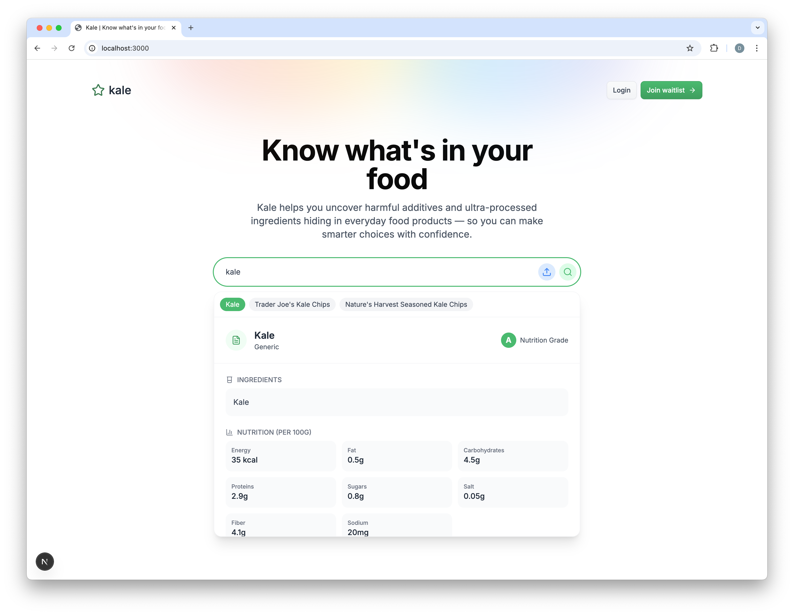

# 🥬 KALE: The App You Never Knew You Needed



## What is this monstrosity?

Kale is yet another Next.js app, because clearly the world needed one more. We made it with React 19, which is so cutting-edge we're not even sure what we're doing.

## Why Kale?

Because all the good vegetable names were taken. Broccoli.js? Taken. Spinach.io? Gone. We're just working with what's left. At least it's not called Brussels-Sprout.ts.

## Features

- It exists
- It probably runs
- It has dependencies (SO MANY DEPENDENCIES)
- It uses TypeScript because we hate ourselves
- It has Tailwind because writing actual CSS is too mainstream

## Getting Started

```bash
# Clone this bad boy
git clone https://github.com/davidyen1124/kale.git

# Enter the jungle
cd kale

# Install 287,394 node modules
npm install

# Watch your computer fans go brrrrr
npm run dev
```

## Production

Don't. Just don't.

## FAQ

### Is this production ready?

Lol no.

### Will this make me rich?

If it does, please let us know how.

### Why is it called Kale?

Because we're trying to trick health-conscious developers into using it.

### Should I contribute to this project?

Only if you've exhausted all your other life options.

## License

This project is licensed under the "Do Whatever You Want, We Don't Care" License - see the LICENSE file for details.

## Credits

- Coffee ☕
- Desperation 😫
- Stack Overflow 🙏
- That one tutorial from 2018 that somehow still works
